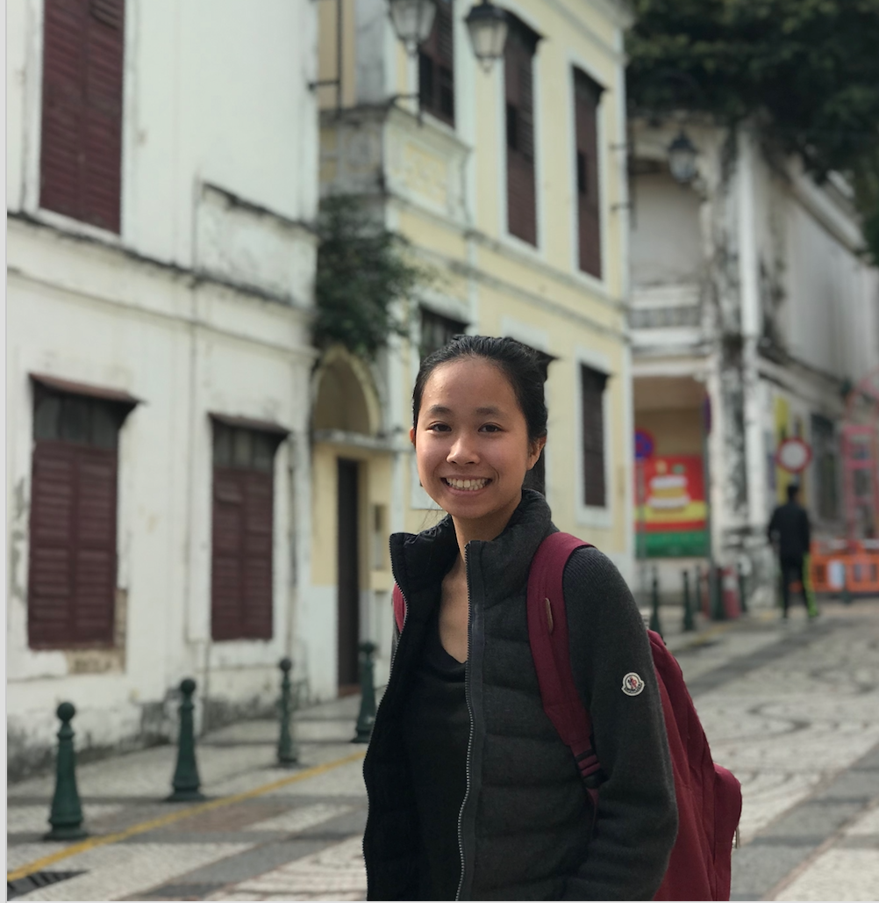

# Team-3 
[TODO: team name]

## Project Synopsis
[TODO: project synopsis]

## Team Members
| Member                | Photo                                         |
| --------------------- | --------------------------------------------- |
| Aitan Grossman        | |
| Tucker (Kenneth) Haas | |
| Sarah Tieu            |  |
| Kally Zheng           | |

## Team Skills
| Member                | Skills                        | Personal Traits  | Desired Growth | Weaknesses |
| --------------------- | ----------------------------- | ---------------- | -------------- | ---------- |
| Aitan Grossman        |               |       |
| Tucker (Kenneth) Haas |               |       |
| Sarah Tieu            | Python, Go, Back-end, ML, NLP | Organized, Cooperative | Need finding, Prototyping, Front-end | Front-end |
| Kally Zheng           |               |       |

## Team Communication
* Facebook Messenger
* Google Team Drive
* [SGM Worksheet](https://docs.google.com/forms/d/e/1FAIpQLSdOqz9D23a8XHXStLg_YtWT21KX18mBW5uO2wVZ32kmDneSRw/viewform)
* @stanford Email
    * aitan
    * thaas19
    * stieu12
    * kally
