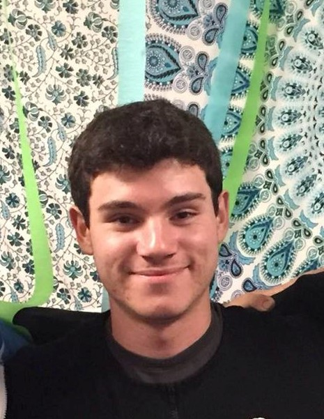
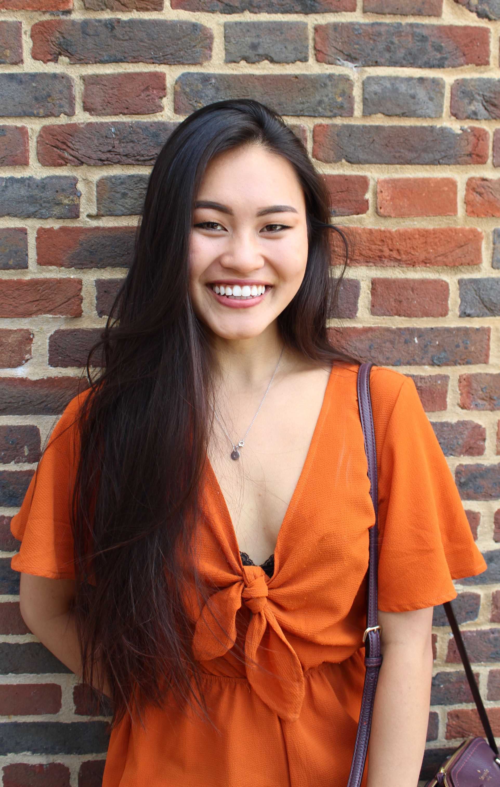

# Team-3 
sNOFLAKE

## Project Synopsis
[TODO: project synopsis]

## Team Members
| Member                | Photo                                         |
| --------------------- | --------------------------------------------- |
| Aitan Grossman        |  |
| Tucker (Kenneth) Haas |  |
| Sarah Tieu            |  |
| Kally Zheng           |  |

## Team Skills
| Member                | Skills                        | Personal Traits  | Desired Growth | Weaknesses |
| --------------------- | ----------------------------- | ---------------- | -------------- | ---------- |
| Aitan Grossman        | Back end, Web, Algorithms | Cooperative, Pragmatic, Likes cuddling | Iterated development, courage | UI design, no friends |
| Tucker (Kenneth) Haas | Backend, System Architecture, Python, C, C++, Go, Project Management | Cooperative, Honest, Strong Willed | Visual Design, Organization | Obsess over details, Web dev
| Sarah Tieu            | Python, Go, Back end, ML, NLP | Organized, Cooperative | Need finding, Prototyping, Front end | Front end |
| Kally Zheng           | Python, Java, Visual Design, Needfinding |  Organized, Open minded, Motivated | Web Development, Mobile Development | Selfconfidence, ML, NLP

## Team Communication
* Facebook Messenger
* Google Team Drive
* [SGM Worksheet](https://docs.google.com/forms/d/e/1FAIpQLSdOqz9D23a8XHXStLg_YtWT21KX18mBW5uO2wVZ32kmDneSRw/viewform)
* @stanford Email
    * aitan
    * thaas19
    * stieu12
    * kally
